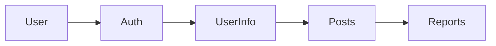

# Ting - 프로젝트를 위한 완벽한 매칭


## 📦 How to Install
<a href="https://apps.apple.com/kr/app/ting-%ED%94%84%EB%A1%9C%EC%A0%9D%ED%8A%B8%EB%A5%BC-%EC%99%84%EB%B2%BD%ED%95%9C-%EB%A7%A4%EC%B9%AD/id6741317435">
    
</a>  

### 클릭 시 앱스토어로 이동합니다.

<br>

## 📱 프로젝트 소개
**Ting**은 원활한 프로젝트의 시작을 지원하기 위해 탄생했습니다.  
개발자, 디자이너, 기획자 등 여러 직군을 타겟으로 하여,  
기존 프로젝트에 참여하거나, 팀원을 구인할 수 있는 플랫폼입니다.  

<a href="https://www.notion.so/tkacl2010/Ting-1a8d4c1226d2804ca52fea8dd887940a?pvs=4">
    
</a>  
<br>
<br>

## 👥 팀원 소개

| Names     | GitHub   | Parts     |
| -------- | -------- | -----------------------------|
| 이재건   | [@Quaker-Lee](https://github.com/Quaker-Lee) | 메인페이지, 마이페이지, 회원정보입력, 프로젝트 초기 세팅, 앱배포 |
| 유태호   | [@taeryu7](https://github.com/taeryu7) | 게시글 상세화면, 신고하기 |
| 나영진   | [@bryjna07](https://github.com/bryjna07) | 게시글 리스트, 게시글 작성, 검색페이지 |
| 오푸른솔   | [@solnamul](https://github.com/solnamul) | 애플로그인 연동, 회원가입, 이용약관 |

<br>

## 📅 프로젝트 기간
- **MVP**: 2025.01.16 ~ 2025.02.17
- **유저피드백 & 버그수정**: 2025.02.17 ~ 2025.02.19

<br>

## 🛠 기술 스택
<p>  
    <!-- Swift -->    
    <!-- UIKit -->    
    <!-- UserDefaults -->    
    <!-- Then -->    
    <!-- SnapKit -->    
    <!-- Firebase -->    
    <!-- Firestore -->    
    <!-- FirebaseAuth -->    <br>
    <!-- AuthenticationServices -->    
    <!-- CryptoKit -->    
    <!-- GitHub -->    
    <!-- Figma -->    
    <!-- Notion -->    
    <!-- Slack -->    
</p>

### 프레임워크 및 라이브러리
- **UIKit**: 인터페이스 구현
- **SnapKit**: 코드 기반 AutoLayout
- **Then**: 선언형 UI 구성
- **Firebase Auth**: 사용자 인증
- **Firebase Firestore**: 데이터베이스
- **AuthenticationServices**: Apple 로그인을 위한 프레임워크
- **CryptoKit**: Apple 로그인 인증에 사용된 해시 라이브러리

### 디자인 패턴
- **BaseView**: 공통 UI 컴포넌트 상속 구조
- **CustomTag**: 재사용 가능한 태그 버튼 컴포넌트
- **NotificationCenter**: 화면 간 이벤트 전달
- **Protocol-Delegate**: 모달 및 팝업 데이터 전달

<br>

## 🛠 개발 환경
- iOS 16.0+
- Swift 6.0+
- MVC Design Pattern

<br>

## 아키텍처


<br>

## 🔥 Firebase 구조

### Collections
```
firebase/
├── users/
│   └── {uid}
├── infos/
│   └── {infoId}
├── posts/
│   └── {postId}
└── reports/
    └── {reportId}
```

### 데이터 흐름도



<br> 

## ⚡️ 주요 기능 및 구현 내용
### 사용자 인증 및 관리
- **Apple 로그인 (Sign in with Apple)**: `AuthenticationServices` 활용
- **비로그인 둘러보기 모드**: Firebase 인증 없이 콘텐츠 접근 가능
- **이용약관 동의 프로세스**: 필수 약관 동의 후 회원가입 진행
- **회원정보 관리 (수정/탈퇴)**: Firebase Firestore와 `UserDefaults` 활용한 CRUD 작업

### 게시글 관리
- **팀원 모집 / 팀 합류 게시글 작성**: Firestore를 활용한 CRUD
- **카테고리별 게시글 분류**: `(개발자, 디자이너, 기획자, 기타)` 필터링 기능
- **게시글 조회 및 페이징 처리**: `lastDocument` 기반 무한 스크롤 적용
- **게시글 수정 및 삭제**: Firebase에서 게시글 정보 업데이트 및 삭제 처리
- **동적 컴포지셔널 레이아웃**: `UICollectionView`를 활용한 메인 화면 구성
- **태그 기반 필터링**: 다중 선택 가능한 필터 UI 적용

### 검색 및 필터링
- **키워드 기반 게시글 검색**: Firestore에서 검색어 기반 쿼리 실행
- **다중 태그 필터링**: `(게시판 유형, 직무, 작업 방식)` 태그 필터링
- **동적 태그 UI 구현**: `TagFlowLayout`을 활용하여 태그 자동 배치

### 신고 및 차단 시스템
- **부적절한 게시글 신고 기능**: 신고 버튼을 통한 Firestore 신고 데이터 저장
- **신고 내역 관리**: 신고된 게시글 및 사용자 관리
- **누적 신고 시 자동 삭제 처리**: 신고 5회 이상 누적 시 자동 삭제 로직 적용 (`Firestore 트랜잭션` 활용)
- **Slack 알림 연동**: 신고 발생 시 관리자에게 실시간 알림 전송
- **특정 유저 차단 기능**: 차단한 유저의 게시글 자동 숨김 처리

### UI/UX 개선
- **`TagFlowLayout`**: 동적 태그 배치 시스템 구현
- **`LoadingFooterView`**: 페이징 로딩 인디케이터 추가
- **`CustomTag`**: 재사용 가능한 태그 UI 구성
- **반응형 레이아웃**: 다양한 기기 해상도 대응

### 마이페이지 시스템
- **`UserInfoService`**: Firebase Firestore를 활용한 회원 정보 관리 (CRUD)
- **회원정보 수정 및 탈퇴**: `UserDefaults`에 저장된 UID를 기반으로 회원 정보 변경 가능
- **로그인 상태 유지**: `Firebase Auth` 인증을 통한 자동 로그인 기능 지원

<br>

## 🔨 Trouble Shooting
 ### 🚀 앱스토어 심사 리젝
  🔗 **관련PR**   
  [#207](https://github.com/ProjectTing/Ting/pull/207), [#209](https://github.com/ProjectTing/Ting/pull/209), [#210](https://github.com/ProjectTing/Ting/pull/210), [#213](https://github.com/ProjectTing/Ting/pull/213), [#215](https://github.com/ProjectTing/Ting/pull/218)  <br>

  🔍 **원인**  
  - 신고하기, 차단하기 등의 기능이 미흡, 지역이라는 불필요한 개인정보를 요구하여 리젝처리됨  

  ✅ **해결 방안**  
  1. **신고한 게시글 숨김** (Firebase에 저장 후 자동 숨김 처리)  
  2. **누적 신고 시 자동 삭제** (중복 신고 방지 및 일정 횟수 초과 시 삭제)  
  3. **Slack 알림 연동** (신고 발생 시 실시간 알림 전송)  
  4. **차단 유저 숨김** (Firebase에 저장 후 자동 숨김 처리)  
  5. **지역 관련 필드 삭제** (사용자의 지역 입력 필드 제거)

  🔥 **개선 효과**  
  - 신고 및, 차단 등 유해컨텐츠와 유저를 분리함으로써 사용자 경험 향상
  - 개발팀이 실시간으로 신고 게시글을 관리할 수 있게 됨
<br>

### 🚀 최신 3개의 게시글을 가져온 후 신고 및 차단된 게시글을 필터링하면 3개 미만으로 표시되는 문제
  🔗 **관련PR**  
  [#238](https://github.com/ProjectTing/Ting/pull/238)  <br>

  🔍 **원인**  
  - Firestore에서 `limit(to: 3)`으로 데이터를 가져온 후 필터링을 수행 → 필터링된 후 게시글 수가 부족해짐  

  ✅ **해결 방안**  
  1. Firestore에서 **최신 10개의 게시글**을 가져옴  
  2. 신고 및 차단된 게시글을 필터링  
  3. 필터링 후 최신 **3개 게시글만 반환**  

  🔥 **개선 효과**  
  - 필터링 후에도 **항상 3개 게시글을 유지**하여 사용자 경험 개선  
  - 신고/차단 비율이 높은 경우, 가져오는 데이터 개수를 조정해 성능 최적화 필요  
<br>


 ### 🚀 닉네임을 변경하지 않아도, 다른 정보를 수정할 때 닉네임 중복 검사가 강제로 실행되는 문제
  🔗 **관련PR**  
  [#160](https://github.com/ProjectTing/Ting/pull/160)  <br>

  🔍 **원인**  
  - `TextField`의 값이 기존 닉네임과 동일한지 확인하지 않고 중복 검사를 실행하여 발생  

  ✅ **해결 방안**  
  1. 서버에서 가져온 기존 닉네임을 **변수에 저장**  
  2. `TextField`의 값과 기존 닉네임을 비교  
  3. **닉네임이 변경되지 않았다면 중복 검사 생략**, 변경된 경우에만 검사 실행  

  🔥 **개선 효과**  
  - **닉네임을 변경하지 않아도 중복 검사 실행 문제 해결**  
  - 불필요한 중복 검사 방지로 **성능 최적화 및 사용자 경험 개선**  
<br>


  ### 🚀 약관 미동의 상태에서도 Firestore에 `termsAccepted: true`로 저장되는 문제
  🔗 **관련PR**  
  [#153](https://github.com/ProjectTing/Ting/pull/153), [#249](https://github.com/ProjectTing/Ting/pull/249)  <br>

  🔍 **원인**  
  1. `SignUpVC`에서 회원가입 시 **약관 동의 여부와 관계없이** `termsAccepted: true`를 Firestore에 저장  
  2. 사용자가 약관을 미동의해도 Firestore에서 동의한 것으로 인식  

  ✅ **해결 방법**  
  ✔ `SignUpVC`에서 `termsAccepted`와 `createdAt` 저장 **제거**  
  ✔ `PermissionVC`에서 **약관 동의 후 Firestore에 업데이트**  

  🔥 **개선 효과**  
  - **약관을 동의하지 않으면 Firestore에 저장되지 않도록 수정**  
  - **재접속 시 약관 동의 단계를 정확히 유지하여 사용자 경험 개선**  


<br>

## 👨🏻‍🔬 테스트
 🔗 **관련PR**  
  [#270](https://github.com/ProjectTing/Ting/pull/270)  <br>
<details>
<summary><strong>유닛테스트</strong></summary>
<br>

# Ting 앱 단위 테스트 시나리오
## 1. PostService 테스트

### 1.1 게시글 업로드 테스트
- [ ] 정상적인 게시글 데이터로 업로드 성공
- [ ] 필수 필드 누락 시 업로드 실패
- [ ] 제목 최대 길이(20자) 제한 검증
- [ ] 태그 배열 데이터 처리
- [ ] 검색 키워드 자동 생성 검증
- [ ] 빈 문자열 입력 처리
- [ ] 공백만 있는 입력 처리
- [ ] 특수문자 포함된 입력 처리
- [ ] 날짜 형식 검증
- [ ] 업로드 실패 시 에러 처리

### 1.2 게시글 조회 테스트
- [ ] 최근 게시글 3개 조회 정확성
- [ ] 페이징 처리 (20개 단위) 검증
- [ ] lastDocument 기반 페이징 정확성
- [ ] 포지션 필터링 정확도
- [ ] 게시글 타입별 필터링
- [ ] 빈 결과 처리
- [ ] 정렬 순서 정확성
- [ ] 데이터 일관성 검증
- [ ] 누락된 필드 처리
- [ ] 네트워크 오류 처리

### 1.3 게시글 수정/삭제 테스트
- [ ] 정상적인 수정 처리
- [ ] 권한 검증
- [ ] 일부 필드만 수정
- [ ] 삭제 후 조회 불가 확인
- [ ] 잘못된 ID로 수정 시도
- [ ] 동시 수정 요청 처리
- [ ] 수정 이력 추적
- [ ] 연관 데이터 업데이트
- [ ] 롤백 처리
- [ ] 캐시 데이터 정리

## 2. 인증 및 회원 관리 테스트

### 2.1 인증 테스트
- [ ] 회원 로그인 처리
- [ ] 비회원 로그인 처리
- [ ] 로그인 상태 유지
- [ ] 로그아웃 처리
- [ ] 자동 로그인
- [ ] 세션 만료 처리
- [ ] 접근 권한 검증
- [ ] 비회원의 제한된 기능 접근
- [ ] 인증 토큰 관리
- [ ] 로그인 상태 변경 이벤트

### 2.2 회원 탈퇴 테스트

#### 2.2.1 탈퇴 프로세스 테스트
- [ ] 약관 동의 체크 검증
- [ ] Apple 재인증 성공/실패 처리
- [ ] Firebase Auth 계정 삭제
- [ ] UserDefaults 데이터 정리
- [ ] 탈퇴 완료 후 SignUpVC로 화면 전환
- [ ] 탈퇴 중 앱 종료 시나리오
- [ ] 탈퇴 후 재로그인 시도 차단
- [ ] 탈퇴 취소 프로세스
- [ ] 탈퇴 실패 시 사용자 피드백
- [ ] 탈퇴 완료 확인

#### 2.2.2 연관 데이터 삭제 테스트
- [ ] users 컬렉션에서 사용자 문서 삭제
- [ ] infos 컬렉션에서 사용자 정보 삭제
- [ ] 작성한 게시글 일괄 삭제 (posts)
- [ ] 작성한 신고 내역 처리 (reports)
- [ ] 피신고 내역 처리
- [ ] Batch 작업 성공 여부 확인
- [ ] 부분 삭제 실패 시 롤백 처리
- [ ] 삭제된 데이터 복구 불가능 확인
- [ ] 대용량 데이터 삭제 성능
- [ ] 삭제 진행률 표시

#### 2.2.3 데이터 정합성 테스트
- [ ] 모든 컬렉션에서 사용자 데이터 완전 삭제 확인
- [ ] 삭제된 게시글 접근 시도
- [ ] 삭제된 신고 내역 접근 시도
- [ ] Firebase Auth와 Firestore 데이터 동기화
- [ ] 연관된 모든 문서 참조 정리
- [ ] 캐시 데이터 정리
- [ ] 로컬 저장소 정리
- [ ] 부분 실패 시 일관성 유지
- [ ] 동시 요청 처리
- [ ] 네트워크 오류 복구

## 3. UserInfoService 테스트

### 2.1 회원정보 생성 테스트
- [ ] 필수 정보 검증
- [ ] 닉네임 중복 체크
- [ ] userId 유효성 검사
- [ ] 데이터 형식 검증
- [ ] 공백 처리
- [ ] 특수문자 처리
- [ ] 최대 길이 제한
- [ ] 생성 시간 기록
- [ ] 초기 설정값 검증
- [ ] 에러 메시지 정확성

### 3.2 회원정보 수정 테스트
- [ ] 기본 정보 수정 성공
- [ ] 닉네임 변경 처리
- [ ] posts 컬렉션 닉네임 업데이트
- [ ] reports 컬렉션 닉네임 업데이트 (신고자/피신고자)
- [ ] infos 컬렉션 닉네임 업데이트
- [ ] 일괄 업데이트 트랜잭션
- [ ] 부분 업데이트 실패 시 롤백
- [ ] 동시 수정 요청 처리
- [ ] 수정 권한 검증
- [ ] 변경 이력 추적

### 3.3 회원정보 조회 테스트
- [ ] UserDefaults 데이터 검증
- [ ] 캐시 데이터 관리
- [ ] 존재하지 않는 정보 조회
- [ ] 권한 체크
- [ ] 데이터 일관성
- [ ] 조회 성능
- [ ] 동시 요청 처리
- [ ] 오프라인 동작
- [ ] 세션 관리
- [ ] 에러 복구

## 3. UI 컴포넌트 테스트

### 3.1 CustomTag 테스트
- [ ] 태그 선택/해제 상태
- [ ] 다중 선택 처리
- [ ] 스타일 변경 검증
- [ ] 탭 이벤트 처리
- [ ] 레이아웃 정확성
- [ ] 비활성화 상태
- [ ] 애니메이션 동작
- [ ] 텍스트 오버플로우
- [ ] 접근성 지원
- [ ] 메모리 누수 검사

### 3.2 TagFlowLayout 테스트
- [ ] 태그 추가/제거
- [ ] 레이아웃 계산
- [ ] 동적 크기 조정
- [ ] 여백 처리
- [ ] 스크롤 동작
- [ ] 터치 이벤트
- [ ] 재사용 처리
- [ ] 성능 측정
- [ ] 메모리 사용량
- [ ] 레이아웃 업데이트

## 4. 화면 전환 및 데이터 전달 테스트

### 4.1 화면 전환 테스트
- [ ] 게시글 작성 화면 전환
- [ ] 상세 화면 전환
- [ ] 뒤로가기 처리
- [ ] 모달 표시
- [ ] 네비게이션 스택
- [ ] 데이터 전달
- [ ] 메모리 해제
- [ ] 상태 저장
- [ ] Deep Link 처리
- [ ] 전환 애니메이션

### 4.2 데이터 전달 테스트
- [ ] Delegate 패턴 동작
- [ ] Protocol 구현
- [ ] 약한 참조 처리
- [ ] 옵셔널 체이닝
- [ ] 순환 참조 방지
- [ ] 데이터 동기화
- [ ] 이벤트 전파
- [ ] 상태 관리
- [ ] 메모리 관리
- [ ] 에러 전파

## 5. 입력 검증 테스트

### 5.1 텍스트 입력 테스트
- [ ] 최대 길이 제한
- [ ] 공백 처리
- [ ] 특수문자 처리
- [ ] 포맷팅 검증
- [ ] 실시간 유효성 검사
- [ ] 키보드 처리
- [ ] 포커스 관리
- [ ] 자동완성
- [ ] 복사/붙여넣기
- [ ] 실행 취소

### 5.2 선택 입력 테스트
- [ ] 단일 선택 처리
- [ ] 다중 선택 처리
- [ ] 선택 해제
- [ ] 필수 선택 검증
- [ ] 상태 변경 이벤트
- [ ] 시각적 피드백
- [ ] 선택 제한
- [ ] 그룹 선택


## 6. 신고 기능 테스트

### 6.1 신고 생성 테스트
- [ ] 정상적인 신고 생성
- [ ] 신고 사유 선택 필수
- [ ] 신고 내용 필수 입력
- [ ] 중복 신고 방지
- [ ] 자기 자신 신고 불가
- [ ] 비회원 신고 불가
- [ ] 삭제된 게시글 신고
- [ ] 신고자/피신고자 정보 저장
- [ ] 신고 시간 기록
- [ ] 신고 상태 관리

### 6.2 신고 관리 테스트
- [ ] 신고 목록 조회
- [ ] 신고 상세 정보 조회
- [ ] 신고 처리 상태 변경
- [ ] 신고 이력 관리
- [ ] 신고 통계 집계
- [ ] 게시글별 신고 수 집계
- [ ] 사용자별 신고 수 집계
- [ ] 신고 데이터 정합성
- [ ] 관리자 권한 검증
- [ ] 신고 처리 알림

## 7. 에러 처리 테스트

### 6.1 네트워크 에러
- [ ] 연결 끊김 처리
- [ ] 타임아웃 처리
- [ ] 재시도 메커니즘
- [ ] 오프라인 모드
- [ ] 에러 메시지
- [ ] 상태 복구
- [ ] 캐시 활용
- [ ] 백그라운드 처리
- [ ] 데이터 동기화
- [ ] 사용자 피드백

### 6.2 입력 에러
- [ ] 필수 필드 검증
- [ ] 형식 검증
- [ ] 중복 검증
- [ ] 범위 검증
- [ ] 유효성 검사
- [ ] 에러 표시
- [ ] 포커스 처리
- [ ] 오류 수정 안내
- [ ] 입력 제한


## 테스트 환경 설정

### 필요한 의존성
- XCTest 프레임워크
- Firebase Test Lab
- SnapKit
- Then

### 테스트 전제조건
1. Firebase 에뮬레이터 설정
2. 테스트용 데이터베이스 구성
3. 테스트 계정 준비
4. UI 테스트를 위한 화면 캡처 도구

### 우선순위 기능
1. 게시글 CRUD 및 권한 관리
2. 회원정보 관리
3. UI 인터랙션
4. 데이터 정합성

## 테스트 실행 가이드

1. 단위 테스트는 독립적으로 실행 가능해야 함
2. UI 테스트는 실제 디바이스에서 진행
3. 테스트 데이터는 매 테스트마다 초기화
4. 성능 측정이 필요한 경우 별도 표시
</details>

<details>
<summary><strong>통합테스트</strong></summary>
<br>
    
# Ting 앱 통합 테스트 시나리오
## 1. 인증 및 회원 관리 플로우

### 1.1 회원가입 플로우
- [ ] Apple 로그인 → 약관 동의 → 회원정보 입력 → 메인화면 이동
- [ ] 필수 약관 동의 검증
- [ ] 회원정보 입력 시 닉네임 중복 체크
- [ ] UserDefaults에 userId 저장 검증
- [ ] Firebase Auth와 Firestore 데이터 동기화 확인

### 1.2 비회원 플로우
- [ ] 비회원으로 시작 → 메인화면 접근
- [ ] 게시글 조회만 가능한지 확인
- [ ] 제한된 기능 접근 시 로그인 유도 알림
- [ ] 로그인 화면 전환 처리

### 1.3 회원 탈퇴 플로우
- [ ] 탈퇴 버튼 → 약관 확인 → Apple 재인증 → 데이터 삭제 → 로그인 화면
- [ ] Firebase Auth, Firestore, UserDefaults 데이터 삭제 검증
- [ ] 연관된 posts, reports, infos 컬렉션 데이터 삭제
- [ ] 실패 시 롤백 처리 검증

## 2. 게시글 관리 플로우

### 2.1 게시글 작성 플로우
- [ ] 작성 화면 진입 → 데이터 입력 → 업로드 → 목록 갱신
- [ ] 필수 입력값 검증
- [ ] 태그 선택 상태 관리
- [ ] 게시글과 작성자 정보 연동
- [ ] 검색 키워드 자동 생성

### 2.2 게시글 수정 플로우
- [ ] 상세화면 → 수정 버튼 → 수정 화면 → 저장 → 상세화면 갱신
- [ ] 작성자 본인만 수정 가능
- [ ] 기존 데이터 로드 및 표시
- [ ] 수정된 내용 실시간 반영
- [ ] 연관된 검색 키워드 업데이트

### 2.3 게시글 삭제 플로우
- [ ] 상세화면 → 삭제 확인 → 삭제 처리 → 목록 화면
- [ ] 작성자 본인만 삭제 가능
- [ ] 관련 신고 내역 처리
- [ ] 목록 화면 자동 갱신

## 3. 목록 및 검색 플로우

### 3.1 메인 화면 플로우
- [ ] 최근 글 3개씩 표시
- [ ] 게시글 타입별 분류
- [ ] 스크롤 시 자동 갱신
- [ ] 카테고리 필터링

### 3.2 목록 화면 플로우
- [ ] 무한 스크롤 동작
- [ ] 새로고침 기능
- [ ] 게시글 선택 및 상세화면 전환
- [ ] 작성 버튼 노출 및 동작

### 3.3 검색 플로우
- [ ] 검색어 입력 → 결과 표시 → 필터 적용
- [ ] 태그 기반 필터링
- [ ] 검색 결과 정렬
- [ ] 결과 없음 처리

## 4. 회원정보 관리 플로우

### 4.1 회원정보 수정 플로우
- [ ] 프로필 화면 → 수정 화면 → 저장 → 프로필 갱신
- [ ] 닉네임 변경 시 연관 데이터 업데이트
  - posts 컬렉션 닉네임
  - reports 컬렉션 신고자/피신고자 닉네임
  - infos 컬렉션 닉네임
- [ ] 일괄 업데이트 트랜잭션 처리
- [ ] 실패 시 롤백 검증

### 4.2 로그아웃 플로우
- [ ] 로그아웃 → UserDefaults 정리 → 로그인 화면
- [ ] 세션 정리
- [ ] 캐시 데이터 정리
- [ ] 화면 전환 처리

## 5. 신고 기능 플로우

### 5.1 신고 처리 플로우
- [ ] 게시글 상세 → 신고 버튼 → 신고 작성 → 완료
- [ ] 비회원 신고 시도 차단
- [ ] 본인 게시글 신고 불가
- [ ] 중복 신고 방지
- [ ] 신고 데이터 저장 및 연동

### 5.2 신고 이력 관리 플로우
- [ ] 신고 기록 저장
- [ ] 게시글 삭제 시 신고 내역 처리
- [ ] 회원 탈퇴 시 신고 내역 처리
- [ ] 신고 상태 관리

## 6. 예외 상황 플로우

### 6.1 네트워크 오류
- [ ] 오프라인 상태 처리
- [ ] 데이터 로드 실패 시 재시도
- [ ] 업로드 실패 시 임시 저장
- [ ] 에러 메시지 표시

### 6.2 동시성 처리
- [ ] 동시 수정 요청 처리
- [ ] 데이터 일관성 유지
- [ ] 트랜잭션 롤백
- [ ] 충돌 해결

### 6.3 권한 검증
- [ ] 로그인 상태 확인
- [ ] 작성자 권한 검증
- [ ] 접근 제한 처리
- [ ] 권한 오류 메시지

## 통합 테스트 실행 가이드

### 테스트 환경 설정
1. 테스트용 Firebase 프로젝트 구성
2. 테스트 계정 및 데이터 준비
3. 네트워크 상태 시뮬레이션 도구 설정
4. 테스트 디바이스/시뮬레이터 준비

### 테스트 데이터 관리
1. 테스트 전 초기 데이터 설정
2. 테스트 후 데이터 정리
3. 테스트 데이터 백업/복원
4. 테스트 간 독립성 유지

### 테스트 순서
1. 기본 인증 및 회원 관리 플로우
2. 게시글 CRUD 플로우
3. 목록 및 검색 플로우
4. 회원정보 관리 플로우
5. 신고 기능 플로우
6. 예외 상황 처리
</details>

<br>

## 📝 Git Convention

<details>
<summary><strong>커밋 메시지</strong></summary>

- Feat: 새로운 기능 추가
- Fix: 버그 수정
- Docs: 문서 수정
- Style: 코드 포맷팅
- Refactor: 코드 리팩토링
- Test: 테스트 코드
- Chore: 기타 변경사항
- Cmt: 주석 수정
</details>


<details>
<summary><strong>PR 규칙</strong></summary>
    
- PR 탬플릿 준수
- 최소 3명의 리뷰어 승인 필요
- 기능별 스크린샷 첨부
</details>

<br>
  
-------------------------------
<br>

# 📈 업데이트  
### v1.0.0 ~ 1.0.3  
- 유저피드백 반영  
- 지역 필드 삭제  
- 유저 차단기능 구현  
- 다크모드, 텍스트필드, 키보드 관련 버그 수정  

### v1.0.4 
- [🚀v1.0.4 런칭](https://github.com/ProjectTing/Ting/pull/253)  

### v1.0.5 (현재 버전)  
- [🚀v1.0.5 런칭](https://github.com/ProjectTing/Ting/pull/264)

### v1.0.6 
- [🚀v1.0.6 런칭](https://github.com/ProjectTing/Ting/pull/279)

